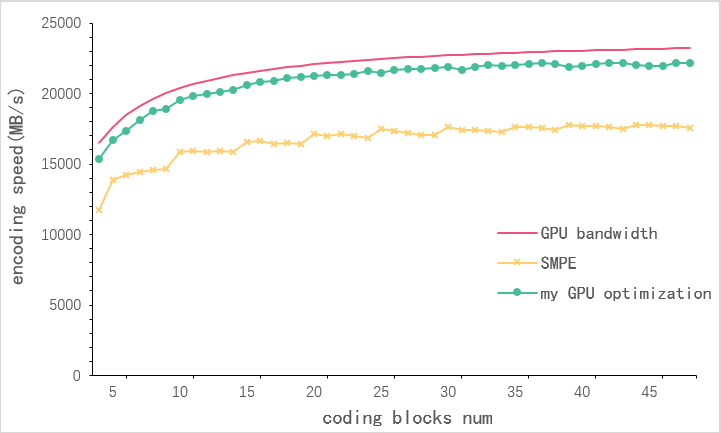
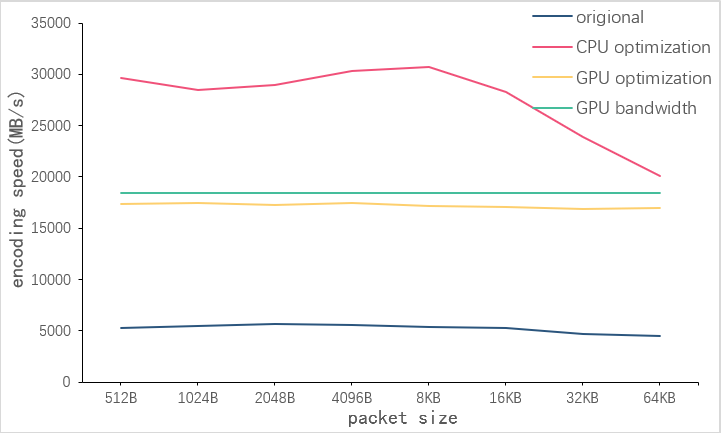

## Folder Description
#### Jerasure-1.2A_0: 
origional jerasure  
#### Jerasure-1.2A_1x: 
only SIMD instruction optimization  
#### Jerasure-1.2A_2x: 
cache and SIMD optimization  
#### Jerasure-1.2A_3x: 
multi-thred, cache and SIMD optimization  
#### Jerasure-1.2A_4x: 
GPU base optimization, GMPE in 41; SMPE in 42; my GPU and stream in 43. 44 is final GPU version, can support encode and decode with any buffer size.
## Paper Reproduction
#### Jerasure-1.2A_31: 
reproduce the paper *OpenMP and POSIX threads Implementation of Jerasure 2.0 Erasure Coding Library*
#### Jerasure-1.2A_41, 42: 
reproduce the paper *PErasure a Parallel Cauchy Reed-Solomon Coding Library for GPUs* GMPE and SMPE  
&emsp;&emsp;don't know whether the problem of my implementation or the optimization proposed in that paper not suitable for PCIe4.0, the encoding speed is not as approach as what depicted in paper. Need to do some changes to get same performance, basically drop the optimization and just implement Jerasure in GPU.
<figure class="half">
    
  
</figure>

## Performance
use encoder with parameter "my_encode_file 6 2 cauchy_good 8 packet_size my_encode_file_size"
<figure class="half">
    

</figure>
Obviously, CPU method outperform GPU method, maybe in the futurn with PCIe5.0 GPU can do more.