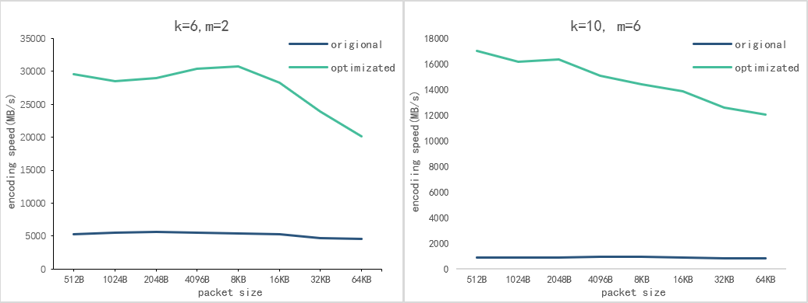

# Jerasure
## Introduction
&emsp;&emsp;Jerasure is an open source erasure codes library create by __James S. Plank__ (University of Tennessee) and __Kevin M. Greenan__ (Box). This library implements some classic erasure codes such as Reed-Solomon Codes, Cauchy Reed-Solomon Codes, Linux RAID-6 and three Minimal Density RAID-6 codes: Blaum Roth codes, Liberation codes and Liber8tion codes. Jerasure revisioned several times and implemented some optimizations proposed in paper.  
&emsp;&emsp;My optimization based on Jerasure2.0 and pays attention to the XOR based erasured codes such as CRS codes and Minimal Density RAID-6 codes, can provide over __30GB/s__ encoding speed whereas the origional implement only __5-6GB/s__.  

## Installation
because optimization base on Jerasure2.0, so the installation process is same as Jerasure2.0:  
first make sure have needed tools, if use Ubuntu can install as follows:  
```
sudo apt install autoconf
sudo apt install libtool
```
and add /usr/local/lib to dynamic library path if not:
```
sudo sh -c "echo '/usr/local/lib' >> /etc/ld.so.conf"
sudo /sbin/ldconfig
```
then install GF-Complete:  
```
git clone git@github.com:ceph/gf-complete.git
cd gf-complete/
autoreconf --force --install
./configure
make
sudo make install
cd ..
```
finally, install Jerasure:  
```
git clone git@github.com:jvlla/Jerasure_xor_optimizated.git
cd Jerasure_xor_optimizated/
autoreconf --force --install
./configure
make
sudo make install
```
## Use Guide
Still the Manual.pdf, but the buffer need allocated by posix_memalign() otherwise Segmentation fault.

## Performance difference
use encoder with parameter "my_encode_file &emsp;6 2 cauchy_good 8 packet_size 5000000"  
&emsp;&emsp;&emsp;&emsp;&emsp;&emsp;&emsp;&emsp;&emsp;&emsp;&emsp;&emsp;&emsp;"my_encode_file 10 6 cauchy_good 8 packet_size 5000000"  
<figure class="half">
    
</figure>

&emsp;&emsp;With 2 coding blocks, this optimization provides up to __30GB/s__ encoding speed and __4-5__ times faster than origional implementation.  
&emsp;&emsp;With 6 coding blocks, this optimization provides up to __17GB/s__ encoding speed and __14-19__ times faster than origional implementation, that because origional speed drop to less than 1GB/s, and optimization can deal with high quantity calculation better so performance keeps better.  
&emsp;&emsp;pay attention, strip size = packetsize * w, that means this optimization can provide satisfied speed with 4k strip size, and at about 64k strip size get best performance, suitable for disk block reality.  
&emsp;&emsp;Besides those, single thread implementation can provide up to 21GB/s encoding speed. AVX-2 and AVX-512 instruction set different performance not much, about 2GB/s.

## Optimization
SIMD: use SIMD instruction do XOR in parallel
cache: use registers store XOR intermediate value
multi-thread: use threads parallel do XOR

## Modification
#### jerasure_schedule_encode() jerasure_schedule_decode_lazy()
&emsp;&emsp;To paralle, instead of directly call jerasure_do_scheduled_operations(), these two function first call jerasure_do_scheduled_operations_thread(), then jerasure_schedule_encode() called by jerasure_do_scheduled_operations_thread(). Also do some needed modification to support multi-thread. 
#### jerasure_schedule_encode()
&emsp;&emsp;To reduce cache access, write some assembly codes directly control XOR operation and the loop.
#### timing.c timing.h
&emsp;&emsp;The origional implementation uses clock() and gettimeofday(), can only giving a maximum possible precision of 1 µs. Switch to clock_gettime() can giving precision of 1 ns.
#### encoder.c decoder.c
&emsp;&emsp;Modify to use the new timing functions and support bigger file.
## More Codes and Versions
&emsp;&emsp;In fact, this optimization is my undergraduate graduation project, so I tried many other optimizations base on Jerasure1.2(for easy to test), such as GPU optimization, and reproduce some optimization proposed in papers, such as PErasure(though in CPU can get better performance). If you want to know more about it, please switch to branch "grad_project". Also, what must mentioned is I think this optimization is __a general way__ to optimizate XOR based erasure codes, so implement it can also help improve performance of other libraries, welcome to use it!
